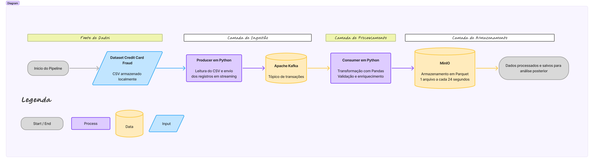

# Fraud Detection Big Data

Projeto de Big Data para deteccao de transacoes fraudulentas em cartao de credito, combinando ingestao em tempo quase real, armazenamento em formato analitico e experimentos de aprendizado de maquina.

## Resumo

Este projeto apresenta uma prova de conceito de um pipeline de Big Data para detecção de fraudes em transações de cartão de crédito. A solução combina ingestão em tempo real com Apache Kafka, processamento e transformação em Python, armazenamento em formato Parquet no MinIO e treinamento de modelos de aprendizado de máquina para classificação de transações legítimas e fraudulentas. O estudo utiliza o dataset Credit Card Fraud Detection, disponibilizado no Kaggle pelo Machine Learning Group da Université Libre de Bruxelles, composto por transações anonimizadas e altamente desbalanceadas. A proposta busca demonstrar como uma arquitetura escalável pode apoiar a identificação rápida de eventos suspeitos, reduzindo perdas financeiras e permitindo monitoramento contínuo dos dados.

**Palavras-chave:** Big Data, detecção de fraude, Kafka, MinIO, aprendizado de máquina, XGBoost.

## Equipe

| Foto | Nome | GitHub | Email |
|---|---|---|---|
||Carlos Eduardo|[Carlos3du](https://github.com/Carlos3du)|[cepc@cesar.school](mailto:cepc@cesar.school)|
||Cristina Matsunaga|[Criismnaga](https://github.com/Criismnaga)|[cm2@cesar.school](mailto:cm2@cesar.school)|
||Francisco Antônio|[fantonioluz](https://github.com/fantonioluz)|[fco@cesar.school](mailto:fco@cesar.school)|
||Gabriel Chaves|[Gabriel-Chaves0](https://github.com/Gabriel-Chaves0)|[gco@cesar.school](mailto:gco@cesar.school)|
||Lucas Gabriel|[LucasGdBS](https://github.com/LucasGdBS)|[lgbs@cesar.school](mailto:lgbs@cesar.school)|
||Maria Fernanda Marques|[FernandaFBMarques](https://github.com/FernandaFBMarques)|[mffbm@cesar.school](mailto:mffbm@cesar.school)|
||Thiago Henrique|[tharaujo17](https://github.com/tharaujo17)|[thas@cesar.school](mailto:thas@cesar.school)|

## Introdução

O uso de cartões de crédito tornou-se parte indissociável do cotidiano moderno, impulsionando um crescimento exponencial no volume de transações financeiras digitais. Esse cenário, embora reflita avanços significativos na economia digital e na inclusão financeira, também cria um ambiente propício para práticas fraudulentas e golpes. A cada ano, bilhões de dólares são perdidos globalmente em decorrência de fraudes em cartões de crédito, impactando tanto consumidores quanto instituições financeiras.

Nesse contexto, a capacidade de identificar transações suspeitas de forma rápida e precisa torna-se um diferencial estratégico e uma necessidade operacional. Sistemas capazes de processar e analisar grandes volumes de dados em tempo real são essenciais para mitigar danos e proteger os envolvidos.

## Motivação

A escolha do tema de detecção de fraudes em cartão de crédito se justifica pela relevância social, econômica e tecnológica do problema. Com a expansão dos pagamentos digitais, o volume de transações financeiras cresce continuamente, tornando inviável a análise manual de eventos suspeitos em escala. Nesse cenário, falhas na identificação de fraudes podem gerar prejuízos financeiros para instituições, lojistas e consumidores, além de comprometer a confiança nos meios de pagamento digitais.

Do ponto de vista de Big Data, o problema é adequado porque envolve características clássicas desse campo: alto volume de eventos, necessidade de processamento com baixa latência, dados heterogêneos e tomada de decisão quase em tempo real. Mesmo utilizando uma base histórica de tamanho controlado para fins acadêmicos, o projeto foi desenhado como uma simulação de ambiente produtivo, no qual transações chegam continuamente, são processadas em fluxo e ficam disponíveis para análise e predição.

Outro fator relevante é o desbalanceamento extremo da base, já que apenas uma fração muito pequena das transações corresponde a fraude. Esse comportamento torna o problema mais próximo de cenários reais e exige cuidado na escolha das métricas, pois a acurácia isolada pode mascarar um modelo incapaz de detectar a classe minoritária. Assim, o projeto permite explorar tanto os desafios de arquitetura de dados quanto os desafios analíticos de aprendizado de máquina aplicado a risco financeiro.

## Objetivo do Projeto
Este projeto tem como objetivo o desenvolvimento de uma prova de conceito para a detecção de transações fraudulentas em tempo real, empregando técnicas de aprendizado de máquina e big data. Para isso, será utilizado o dataset [Credit Card Fraud Detection](https://www.kaggle.com/datasets/mlg-ulb/creditcardfraud), disponibilizado pelo grupo MLG da Universidade Livre de Bruxelas (ULB) e embora seja de dimensão reduzida, toda a arquitetura é concebida sob a ótica de Big Data, demonstrando como soluções desse tipo se comportariam em ambientes de produção com volumes massivos de dados.

O dataset é composto por transações anonimizadas de cartões de crédito europeus e é amplamente adotado em estudos sobre o tema. O conjunto de dados reúne transações realizadas por portadores de cartões de crédito europeus em setembro de 2013, ao longo de dois dias. São 284.807 transações no total, das quais apenas 492 correspondem a fraudes — representando aproximadamente 0,172% dos registros, o que caracteriza um dataset altamente desbalanceado.

O pipeline é estruturado seguindo a arquitetura Medallion, com separação clara de responsabilidades entre camadas, garantindo rastreabilidade, reprodutibilidade e qualidade progressiva dos dados ao longo do fluxo.

A camada Gold representa a entrega de valor do projeto. Nela, cada transação recebe um score de probabilidade de fraude e uma classificação binária, gerados pelo modelo em tempo real. A partir dessas predições, são consolidados os principais indicadores de negócio: 
- valor total exposto a fraude,
- valor potencialmente salvo pela detecção correta e
- custo estimado dos falsos positivos. 

As transações são ainda segmentadas por nível de risco — baixo, médio e alto — e o desempenho do modelo é monitorado continuamente por meio de métricas como AUPRC, F1-score, Precision e Recall.

## Arquitetura

A pipeline implementada segue a ideia da arquitetura Medallion, com separação progressiva entre ingestão, transformação e consumo analítico.



Fluxo principal:

1. O producer baixa o dataset, quando necessário, e publica as transações no tópico Kafka `creditcard`.
2. O broker Kafka recebe os eventos e permite o consumo continuo das mensagens.
3. O consumer valida, transforma e enriquece os registros.
4. As transações transformadas são agrupadas em janelas de 24 segundos.
5. Os dados processados são gravados no MinIO em formato Parquet, no bucket `silver`.

Componentes:

| Camada | Tecnologia | Papel |
|---|---|---|
| Ingestão | Kafka, kafka-python | Simular o fluxo continuo de transações |
| Processamento | Python, Pandas, scikit-learn | Validar, transformar e enriquecer os registros |
| Armazenamento | MinIO, Parquet | Persistir dados transformados em formato colunar |
| Orquestração | Docker Compose, Poe the Poet | Subir e controlar os servicos locais |
| Modelagem | XGBoost, scikit-learn, imbalanced-learn | Treinar e avaliar modelos de classificação |

```md
## Metodologia

A metodologia foi organizada como um pipeline de dados inspirado na arquitetura Medallion, separando o fluxo em camadas progressivas de qualidade e utilidade. A solução foi implementada em ambiente local conteinerizado com Docker Compose, permitindo simular componentes de uma arquitetura distribuída sem depender de infraestrutura em nuvem.


### Fonte dos dados

A fonte utilizada foi o dataset [Credit Card Fraud Detection](https://www.kaggle.com/datasets/mlg-ulb/creditcardfraud), disponível no Kaggle. A base contém 284.807 transações realizadas por cartões de crédito europeus em setembro de 2013, ao longo de dois dias. Por questões de confidencialidade, as variáveis originais foram transformadas por PCA, resultando nos atributos `V1` a `V28`, além das colunas `Time`, `Amount` e `Class`. A coluna `Class` identifica a classe da transação, sendo `0` para transações normais e `1` para fraudes.

### Ingestão

A ingestão é realizada por um producer em Python, localizado em `src/ingestion/producer/producer.py`. Quando o arquivo `dados/creditcard.csv` ainda não existe localmente, o script `src/scripts/download_csv.py` utiliza a CLI do Kaggle para baixar e descompactar o dataset. Em seguida, o producer lê o CSV com Pandas e publica cada transação como uma mensagem JSON no tópico Kafka `creditcard`.

O Apache Kafka atua como barramento de eventos da solução, desacoplando a origem dos dados do processamento. Essa decisão permite simular um fluxo contínuo de transações, no qual novos registros podem ser consumidos por diferentes aplicações sem alterar a etapa de coleta. A interface Kafdrop também foi incluída no `docker-compose.yml` para inspeção dos tópicos, mensagens e offsets durante a execução.

### Transformação

A transformação é executada pelo consumer em Python, localizado em `src/ingestion/consumer/consumer.py`. O consumer lê as mensagens do tópico `creditcard`, valida o schema esperado e descarta registros com colunas ausentes, valores nulos, tipos inválidos ou faixas inconsistentes, como valores negativos em `Time` ou `Amount` e classes diferentes de `0` e `1`.

Após a validação, são aplicadas transformações para enriquecer os dados:

- renomeação de `Time`, `Amount` e `Class` para nomes mais descritivos;
- criação da coluna `is_fraud`, indicando transações normais ou fraudulentas;
- normalização incremental do valor da transação com `StandardScaler`;
- criação de `transaction_amount_log` usando `log1p`;
- criação de faixas de horário por meio de `transaction_hour_bucket`;
- categorização do valor da transação em `baixo`, `medio`, `alto` e `muito_alto`.

Os registros transformados são acumulados por janelas de 24 segundos, com base no campo `transaction_time`. Ao final de cada janela, o lote é convertido para Parquet com PyArrow. Esse formato foi escolhido por ser colunar, eficiente para consultas analíticas e comum em pipelines de Big Data.

### Carregamento e armazenamento

O carregamento é feito no MinIO, que simula um armazenamento de objetos compatível com a API S3. O consumer cria o bucket `silver`, caso ele ainda não exista, e grava os arquivos Parquet no caminho `transformed/window_24s=<janela>.parquet`.

Na lógica da arquitetura Medallion, a base original representa a camada Bronze, pois preserva os dados brutos do dataset. A camada Silver corresponde aos dados validados, padronizados e enriquecidos gravados no MinIO. A camada Gold representa a etapa analítica do projeto, na qual as transações são usadas para treinamento, avaliação e aplicação do modelo de detecção de fraude.

### Camada Gold e inferência do modelo

A camada Gold é responsável por transformar os dados processados da camada Silver em informação analítica e acionável. Para isso, foi implementado um serviço específico, executado via Docker Compose, que lê os arquivos Parquet armazenados no bucket `silver`, monta as variáveis esperadas pelo modelo e aplica o classificador treinado.

O modelo utilizado nessa etapa é o XGBoost salvo em `models/xgb_model.pkl`. A configuração do serviço Gold aponta para esse artefato por meio da variável `MODEL_PATH=/app/models/xgb_model.pkl`, separando corretamente os arquivos de dados, localizados em `dados`, dos artefatos de machine learning, armazenados em `models`.

Durante o processamento, o serviço Gold realiza as seguintes etapas:

- leitura dos arquivos Parquet da camada Silver;
- construção das features utilizadas pelo modelo, incluindo variáveis originais e derivadas;
- cálculo da probabilidade de fraude por meio de `predict_proba`;
- geração da classificação binária da transação com base em um limiar de decisão;
- atribuição do nível de risco da transação, como `baixo`, `medio` ou `alto`;
- gravação dos resultados no bucket `gold`, no caminho `predictions/`.

Com isso, a camada Gold passa a armazenar não apenas os dados transformados, mas também os resultados da predição, como `fraud_probability`, `is_fraud_pred` e `risk_level`. Essa estrutura permite que os dados sejam consumidos posteriormente por dashboards, relatórios ou sistemas de alerta.

### Visualização e dashboard

Além da geração das predições, o projeto inclui um dashboard para visualização dos dados da camada Gold. Essa interface consome os arquivos armazenados em `predictions/` no bucket `gold` e apresenta métricas agregadas sobre as transações classificadas.

O dashboard foi estruturado para exibir informações como total de transações processadas, quantidade de fraudes detectadas, taxa de fraude, probabilidade média de fraude, distribuição por nível de risco, distribuição das probabilidades e últimas transações classificadas.

Para evitar sobrecarga na leitura dos dados, foi adicionada uma configuração de limite máximo de arquivos carregados pelo dashboard, definida pela variável `DASHBOARD_MAX_FILES`. Essa configuração impede que a aplicação tente carregar indefinidamente todos os arquivos da camada Gold conforme o pipeline cresce. Além disso, o dashboard utiliza cache com tempo de expiração baseado em `REFRESH_INTERVAL`, reduzindo leituras repetidas no MinIO e tornando a interface mais estável.

Essa etapa fecha o ciclo do pipeline, permitindo acompanhar os resultados produzidos pela camada Gold de forma visual e operacional.

### Modelagem e destino

A etapa analítica foi conduzida nos notebooks em `src/notebooks`, com análise exploratória e experimentos de classificação. O modelo principal utiliza XGBoost para distinguir transações legítimas e fraudulentas. Também foi avaliada uma abordagem com SMOTE para lidar com o desbalanceamento da classe fraudulenta.

O destino final da solução é a geração de predições e indicadores de negócio. Em um cenário produtivo, a camada Gold poderia alimentar dashboards, sistemas antifraude, alertas operacionais e APIs de decisão em tempo real. Neste projeto, o valor entregue está na demonstração integrada do fluxo: ingestão em Kafka, transformação em stream, armazenamento em Parquet no MinIO, aplicação do modelo na camada Gold e visualização dos resultados em dashboard.

A primeira análise dos dados pode ser encontrada no notebook [Data Analysis](src/notebooks/aed.ipynb), onde exploramos as características das transações, a distribuição dos dados e identificamos padrões relevantes para a detecção de fraudes.

### Ferramentas utilizadas

#### Ingestão de dados

- Apache Kafka
- kafka-python
- Kaggle
- Kaggle CLI

#### Processamento, transformação e inferência

- Python
- Pandas
- NumPy
- scikit-learn
- XGBoost
- Joblib

#### Armazenamento

- MinIO
- Parquet
- PyArrow

#### Visualização

- Streamlit
- Plotly

#### Orquestração e ambiente

- Docker
- Docker Compose
```

## Resultados

Foram realizados experimentos utilizando o algoritmo XGBoost para a classificação de transações fraudulentas e legítimas. Devido ao elevado desbalanceamento da base de dados, a principal métrica adotada para avaliação foi a Área Sob a Curva ROC (AUC-ROC), complementada pelas métricas Precision, Recall e F1-Score, que permitem uma análise mais adequada do desempenho sobre a classe minoritária.

Durante a etapa de treinamento, diferentes combinações de hiperparâmetros foram avaliadas com o objetivo de identificar a configuração de melhor desempenho. O modelo selecionado apresentou profundidade máxima igual a 3, taxa de aprendizado de 0,039, subsample de 0,8 e colsample_bytree de 0,9. Essa configuração alcançou AUC-ROC de 0,9836 no conjunto de validação, evidenciando elevada capacidade de distinguir transações fraudulentas de transações legítimas.

Após a seleção do modelo, foi realizada sua avaliação no conjunto de testes. Os resultados obtidos são apresentados na Tabela X, por meio da matriz de confusão, permitindo analisar a distribuição de acertos e erros entre as classes de transações legítimas e fraudulentas.

A avaliação no conjunto de testes produziu a matriz de confusão apresentada na Tabela X.

| Classe Real | Predito Normal | Predito Fraude |
|------------|---------------:|---------------:|
| Normal     | 56.859         | 3              |
| Fraude     | 22             | 78             |

Com base nesses resultados, foram obtidas as seguintes métricas:

| Métrica   | Valor   |
|-----------|---------:|
| AUC-ROC   | 0,9836   |
| Precision | 96,30%   |
| Recall    | 78,00%   |
| F1-Score  | 86,19%   |
| Acurácia  | 99,96%   |

Os resultados demonstram excelente desempenho na identificação de transações fraudulentas. O modelo foi capaz de detectar corretamente 78% das fraudes presentes no conjunto de testes, ao mesmo tempo em que manteve uma taxa extremamente baixa de falsos positivos, classificando incorretamente apenas três transações legítimas como fraudulentas.

Também foi avaliada uma abordagem utilizando a técnica SMOTE para balanceamento das classes. Após otimização dos hiperparâmetros por meio de Randomized Search, o modelo alcançou AUC-ROC de 0,9821 e Recall de 85%. Embora tenha apresentado ganho na capacidade de detectar fraudes, o desempenho geral foi semelhante ao modelo treinado diretamente sobre os dados originais, evidenciando a robustez do algoritmo XGBoost mesmo diante de um conjunto altamente desbalanceado.

Sob a perspectiva de negócio, os resultados indicam que a solução possui potencial para reduzir significativamente perdas financeiras associadas a fraudes em cartões de crédito, mantendo baixo impacto sobre transações legítimas. Além disso, a arquitetura proposta demonstrou a viabilidade de utilização de tecnologias de Big Data para processamento e classificação de eventos em tempo real, permitindo escalabilidade e monitoramento contínuo das predições geradas pelo modelo.

Além do desempenho preditivo, o projeto demonstrou a viabilidade da construção de um pipeline de detecção de fraudes em tempo real utilizando uma arquitetura baseada em Big Data. A utilização do padrão Medallion permitiu organizar o fluxo de dados em diferentes níveis de refinamento, garantindo rastreabilidade, qualidade dos dados e facilidade de monitoramento das predições geradas pelo modelo.

## Conclusão

O projeto demonstrou a viabilidade de uma solução de Big Data para detecção de fraudes em cartão de crédito, integrando Kafka, processamento em Python, armazenamento em Parquet no MinIO, inferência com XGBoost e visualização em dashboard. A organização em camadas no modelo Medallion contribuiu para separar dados brutos, dados transformados e resultados analíticos, tornando o pipeline mais rastreável e estruturado.

Os resultados obtidos indicam bom desempenho do modelo, com AUC-ROC de 0,9836, Precision de 96,30%, Recall de 78,00% e F1-Score de 86,19%. A baixa quantidade de falsos positivos mostra que o modelo evitou classificar muitas transações legítimas como fraude. No entanto, a existência de 22 fraudes não detectadas evidencia que o Recall ainda pode ser aprimorado, especialmente por se tratar de um problema em que falsos negativos representam risco financeiro direto.

A principal dificuldade do projeto foi lidar com o forte desbalanceamento da base, além de adaptar um dataset histórico para uma simulação de fluxo contínuo. Também foram identificados desafios de integração entre os serviços do pipeline e de controle do volume de dados consumido pelo dashboard.

Como trabalhos futuros, recomenda-se integrar alertas em tempo real, ajustar o limiar de classificação conforme o custo de negócio, monitorar drift dos dados, versionar modelos e expandir a solução para uma infraestrutura mais escalável.

## Setup

Este projeto usa [uv](https://docs.astral.sh/uv/) para gerenciar dependências.

1. Clone o repositório:

    ```bash
    git clone https://github.com/Carlos3du/fraud-detection-bigdata
    ```

2. Acesse o diretório do projeto:

    ```bash
    cd fraud-detection-bigdata
    ```

3. Instale o `uv`, caso ainda não tenha:

    ```bash
    pip install uv
    ```

4. Instale as dependências:

    ```bash
    uv sync
    ```

5. Configure as variáveis de ambiente:

    ```bash
    cp .env.example .env
    ```

    Edite o arquivo `.env` com as credenciais do MinIO:

    ```env
    MINIO_ROOT_USER=seu_usuario
    MINIO_ROOT_PASSWORD=sua_senha
    ```

6. Suba os serviços:

    ```bash
    uv run poe up
    ```

7. Para acompanhar os logs:

    ```bash
    uv run poe logs
    ```

8. Para parar os serviços:

    ```bash
    uv run poe down
    ```

## Acessos locais

| Serviço | URL |
|---|---|
| Kafdrop | <http://localhost:9000> |
| MinIO API | <http://localhost:9001> |
| MinIO Console | <http://localhost:9090> |

## Estrutura do projeto

```text
.
├── docker-compose.yml
├── pyproject.toml
├── src
│   ├── ingestion
│   │   ├── consumer
│   │   └── producer
│   ├── notebooks
│   └── scripts
├── documentação
